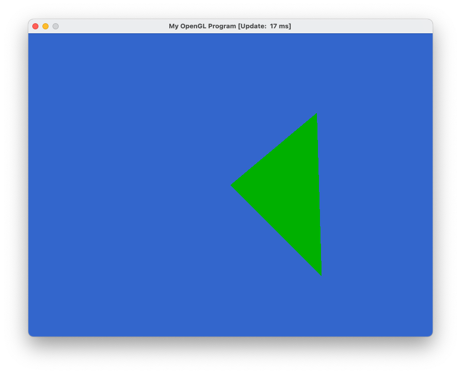

# Compiling

- The project is setup for CMake. Compiling each example is straightforward---they are located in the `examples`
  directory. Make sure that SDL is installed on the device or compiling will not work. On MacOS
  I used brew for SDL.

# Examples

## Triangle Colored


## Cube3D


## CubeLit


## ModelLoad


# Questions

## Q1

> When calling SDL `CreateWindow()` we passed 100 for the second and third parameters. Try changing these numbers, what is the effect?

They determine the `(x,y)` starting position (in pixels) of the window from the top left of the screen to the top left
of the window.

## Q2

> In Cube3D.cpp we call `glEnable(GL DEPTH TEST)`. Remove this call, how do you explain the resulting image?

It appears the way the cube is drawn is not consistently furthest to closest. Therefore, sides that should be blocked
often still show.

## Q3

> Currently, all of our examples exits when escape is pressed. Update the code to also exit when the “Q” key is pressed.
> What did you need to change?

Change `if (windowEvent.type == SDL_KEYUP && windowEvent.key.keysym.sym == SDLK_ESCAPE)` to
`if (windowEvent.type == SDL_KEYUP && windowEvent.key.keysym.sym == SDLK_q) `

## Q4

> Create a new model file, by hand, that contains a single large triangle.
> Load this model instead of teapot.txt.
> Upload a picture of the rendering of this large triangle.



with the model **triangle.txt**:

```text
25
0
0
0
123
123
0
0
1
1
0
0
123
123
0
0
1
0
1
0
123
123
0
0
1
```

# Extra Credit

None so far

# Summary

This exercise was helpful to make sure that I could get the libraries working together. Probably 60% of my time was
setting up CMake with SDL/Glad/GLM, but once I got it setup, it works very well in CLion. I think the introduction to
the model format was also useful. Clearly, when working with big models using a text file will not be enough. I wonder
if most 3D modeling software like blender supports the plaintext format we use.

